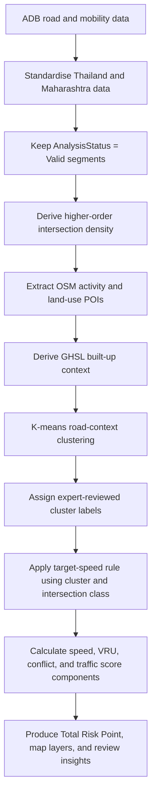

# AI4SaferRoad: Safe Speed Alignment and Priority Methodology

## 1. Purpose

AI4SaferRoad is a segment-level screening method for reviewing whether an ADB-provided **reported posted speed limit** is aligned with a context-sensitive Safe System target speed.

The method does not determine the legal regulatory speed limit. It identifies road segments where the reported limit, the observed high-end operating speed, or both appear inconsistent with the road context and therefore warrant review by the responsible road authority.

The analysis is applied to valid ADB road segments in Thailand and Maharashtra, India. The workflow is designed so that it can be reapplied in other countries where comparable road geometry, speed, OpenStreetMap, and GHSL data are available.

### Outputs for each valid road segment

- Road-context cluster
- Intersection-conflict class
- Safe System target speed
- Reported posted-speed-limit gap
- P85 operating-speed gap
- Vulnerable-road-user, or VRU, exposure score
- Traffic-exposure score
- Total Risk Point, from 0 to 100
- Safe System interpretation and review flags

> **Scope of the result.** The original ADB segment is retained as the analytical unit. Results are therefore corridor-level screening findings. They do not prescribe a precise local speed zone at every school, market, or bus stop located along a long road segment.

---

## 2. Methodological basis

The method follows three principles.

1. **Context-sensitive Safe System speed management.** Target speeds are derived from likely road-user interaction and conflict conditions, not from the existing speed limit or from P85 alone [1][2].
2. **Self-explaining roads.** P85 is used as a diagnostic of whether the road environment appears to encourage travel speeds consistent with the target, rather than as the basis for setting that target [3].
3. **Explainable AI.** K-means is used only to identify recurring road-context patterns. A transparent, rule-based layer then determines target speed and the priority score [4][5].

The fixed 10 km/h gap bands in the scoring system are an interpretable prioritisation convention. They are not a direct prediction of crash or fatality probability. They are supported by evidence that injury severity rises rapidly with increasing collision speed, particularly where pedestrians are exposed [2][6].

---

## 3. Analytical workflow



---

## 4. Data inputs and their role

| Source | Form | Variables used | Role |
|---|---|---|---|
| ADB road and mobility data | Road lines and segment attributes | `speed_limit`, `p85_speed`, `ranked_percentile`, `road_class`, `analysis_status`, geometry | Reported-limit review, operating-speed diagnostic, traffic exposure, intersection derivation, analysis scope |
| OpenStreetMap | Point, line, and polygon features extracted from regional PBF files | Public transport, office, school, commercial, and industrial features | Road-context clustering and local VRU-activity evidence |
| GHSL Built-up Surface, 2020 | 100 m raster | Built-up share and built-up continuity | Settlement and built-environment context |
| User-defined configuration saved by the notebook | CSV configuration files | Cluster names, initial target speeds, context group, baseline VRU points | Transparent expert interpretation of data-driven clusters |

### Data not used in the current prototype

Mapillary imagery, sidewalk data, cycleway data, and other road-protection features are not used in the score because their coverage is not sufficiently consistent across the study areas. Their absence is not interpreted as proof that protection is absent.

---

## 5. Data preparation and scope

### 5.1 Standardisation

The notebook harmonises the Thailand and Maharashtra source files into a common schema. It retains country of origin, source segment identifier, road class, reported speed limit, P85 speed, ranked traffic percentile, and road geometry.

Thailand's `RankedPercentile` is already expressed on a 0 to 100 scale. Maharashtra's value is converted from 0 to 1 into 0 to 100.

### 5.2 Inclusion rule

Only segments with `analysis_status = Valid` are scored. Segments outside this scope remain available as unassessed records and are not interpreted as low risk.

### 5.3 Missing reported speed limits

For implementation continuity, a missing, zero, or negative `speed_limit` value is replaced with **80 km/h** before the score is calculated. The field `speed_limit_imputed = True` flags these cases in the output.

> Results for imputed-speed segments must be interpreted as data-verification candidates. The imputed value is not treated as a verified posted speed limit.

---

## 6. Derived intersection-conflict data

### 6.1 Purpose

Intersection density is used as a proxy for repeated side-impact and crossing-conflict opportunity. It informs both the target-speed rule and the final priority score.

### 6.2 Network used

To avoid treating every digitisation vertex as an intersection, the notebook derives intersections only from mapped higher-order roads with the following OSM-style road classes:

- `primary`
- `secondary`
- `trunk`
- `motorway`

Endpoint locations are snapped within 50 m to form common nodes. A crossing point is treated as an endpoint intersection when it lies within 5 m of an endpoint. The approach is intentionally conservative and should be interpreted as an indicator of mapped higher-order network conflict, not a complete inventory of local streets, driveways, or informal access points.

### 6.3 Metric

```text
intersection_count_per_km = valid at-grade intersection count / segment length in kilometres
```

The target-speed stage classifies this measure according to the segment's configured context group.

| Context group | Low | Moderate | High |
|---|---:|---:|---:|
| Rural-like | 0 intersections/km | >0 to <1 intersections/km | >=1 intersection/km |
| Built-up | <2 intersections/km | >=2 to <6 intersections/km | >=6 intersections/km |

The thresholds are an explicit screening configuration. They are informed by literature connecting greater access and intersection density with higher conflict opportunity, but they are not presented as universal legal speed-limit thresholds [7].

---

## 7. OpenStreetMap activity and land-use context

### 7.1 POI groups and search distance

For each road segment, the notebook calculates the shortest geometric distance from POI features to the complete road-segment geometry. It also calculates POI count, minimum distance, and median distance.

| POI group | Search distance | Main analytical role |
|---|---:|---|
| Public transport | 250 m | Walking, waiting, crossing, and transfer activity |
| Office | 250 m | Secondary urban activity signal |
| School | 250 m | Child-pedestrian and school-route activity signal |
| Commercial | 250 m | Roadside retail, stopping, crossing, and local-access activity |
| Industrial | 1,000 m | Freight, worker, motorcycle, and logistics-access context |

POI counts are normalised by segment length to produce POI density per kilometre for clustering. Median distances are capped at the group search radius before clustering. This prevents no-POI records from creating unbounded values.

> Missing OSM POIs are not treated as evidence that a road has no pedestrians, cyclists, settlements, or local activity. They only indicate that no relevant POI was found in the defined OSM search area.

---

## 8. GHSL built-up context

GHSL Built-up Surface 2020 is used to describe the surrounding settlement pattern. Because the GHSL input has 100 m spatial resolution, the method does not claim to identify exact building frontage or 50 m roadside conditions.

### 8.1 Sampling design

Each original road segment is assessed in consecutive 100 m units. For every unit, the notebook samples across a 200 m corridor, consisting of 100 m on each side of the road, at five lateral offsets:

```text
-80 m | -40 m | road centreline | +40 m | +80 m
```

A unit is considered built-up when its mean built-up share across valid samples is at least 15%. At least three valid lateral samples are required.

### 8.2 Derived indicators

| Field | Meaning |
|---|---|
| `built_up_share_pct` | Overall mean built-up share sampled along the segment corridor |
| `built_up_continuity_pct` | Percentage of consecutive 100 m units classified as built-up |

Built-up share captures the overall development intensity around the road. Built-up continuity distinguishes continuous settlement or ribbon development from isolated pockets of development.

---

## 9. AI component: road-context clustering

### 9.1 Purpose

K-means clustering groups road segments with similar combinations of built-up context, activity-generator density, and POI proximity. It does **not** learn or predict a speed limit.

The question answered by the model is:

> What recurring road-context type does this segment represent?

### 9.2 Model features

| Feature family | Inputs | Preparation |
|---|---|---|
| POI density | Public transport, office, school, commercial, and industrial counts per kilometre | `log1p` transformation |
| POI proximity | Median distance to each POI group | Capped at 250 m for non-industrial POIs and 1,000 m for industrial POIs |
| Built-up context | GHSL built-up share and continuity | Original percentage values |

Motorway segments are excluded from K-means and assigned to the rule-based **Cluster Z**.

### 9.3 Training and selection process

1. Prepare the input features for all valid, non-motorway segments.
2. Apply country-balanced weighting and standardisation so that one study area does not dominate the model solely because it contains more road segments.
3. Test K values from 3 to 8.
4. Evaluate each candidate using:
   - mean country-level silhouette score;
   - Davies-Bouldin score;
   - repeated-sample cluster stability, measured by Adjusted Rand Index;
   - centroid matching distance across repeated runs;
   - minimum and maximum cluster share guardrails.
5. Select the best-performing eligible K through a weighted multi-metric ranking.
6. Fit the final K-means model and export the fitted model, feature configuration, feature audit, cluster profile, and K-selection dashboard.
7. Inspect cluster profiles and assign intelligible road-context labels through the notebook's interactive configuration step.

The cluster labels used in the submitted configuration are listed below.

| Cluster | Label | Interpretation |
|---|---|---|
| A | Urban commercial strip | Developed roadside retail or suburban commercial corridor with moderate built-up activity |
| B | Dense mixed-use urban activity center | Dense urban context with high public transport, office, commercial, and mixed activity |
| C | Transport-and-service interurban corridor | Mostly open interurban road with periodic bus-stop or roadside-service activity |
| D | Low-activity / open context | Low observed OSM POI and built-up activity, likely rural, peripheral, or undeveloped context |
| E | Industrial-adjacent / logistics fringe | Industrial, freight, factory, warehouse, or logistics-access context |
| F | School-adjacent open corridor | Open or semi-rural corridor with nearby schools but generally limited built-up activity |
| G | School-and-commercial urban corridor | Urban corridor with education and commercial activity, likely high pedestrian exposure |
| Z | Motorway | Rule-based motorway category, not learned by K-means |

---

## 10. Target-speed rule

### 10.1 Purpose

The target speed is a Safe System screening value used to review the reported posted speed limit. It is not an automatic legal speed-limit recommendation.

The workflow deliberately does not use P85 to create the target. P85 is used later to test whether the road environment appears self-explaining for the target speed.

### 10.2 Submitted configuration

| Cluster | Context group | Initial target speed | Target after intersection adjustment |
|---|---|---:|---:|
| A: Urban commercial strip | Built-up | 50 km/h | 50 km/h for low, moderate, or high density |
| B: Dense mixed-use urban activity center | Built-up | 30 km/h | 30 km/h for low, moderate, or high density |
| C: Transport-and-service interurban corridor | Rural-like | 70 km/h | 50 km/h only when density is high |
| D: Low-activity / open context | Rural-like | 70 km/h | 50 km/h only when density is high |
| E: Industrial-adjacent / logistics fringe | Rural-like | 70 km/h | 50 km/h only when density is high |
| F: School-adjacent open corridor | Rural-like | 70 km/h | 50 km/h only when density is high |
| G: School-and-commercial urban corridor | Built-up | 30 km/h | 30 km/h for low, moderate, or high density |
| Z: Motorway | Rule-based | 100 km/h | 100 km/h, no intersection adjustment |

The implemented target-speed function is:

```text
For Cluster Z:
    target speed = initial target speed

For all other clusters:
    if intersection density is High:
        target speed = min(50 km/h, initial target speed)
    otherwise:
        target speed = initial target speed
```

### 10.3 Important interpretation for Cluster F

Cluster F receives a 70 km/h corridor-level target when intersection density is low or moderate. A school near a long segment increases the VRU priority score and creates a school-route review signal, but it does not automatically reduce the target of the entire segment to 30 km/h.

This avoids treating one school near a long, mostly open corridor as proof that the entire corridor is a school zone. The output should instead prompt a local verification of school access, pedestrian routes, crossings, and speed treatment.

### 10.4 Motorway treatment

Motorways are kept separate from pedestrian-context clustering and assigned a 100 km/h target in the submitted configuration. The dashboard identifies them as motorways so that their score is not interpreted in the same way as an urban or village street.

---

## 11. Priority scoring

The **Total Risk Point** ranks segments for speed-limit and speed-management review. It has a maximum value of 100.

```text
Total Risk Point =
  reported-limit-to-target score
+ VRU exposure score
+ P85-to-target score
+ intersection-conflict score
+ traffic-exposure score
```

### 11.1 Reported posted-limit-to-target score, maximum 40

```text
posted-limit gap = reported speed_limit - target_speed_limit
```

| Excess above target | Classification | Points |
|---|---|---:|
| <=0 km/h | Align | 0 |
| >0 to 10 km/h | Slight Excess | 10 |
| >10 to 20 km/h | Moderate Excess | 20 |
| >20 to 30 km/h | High Excess | 30 |
| >30 km/h | Very High Excess | 40 |

This is the principal indicator of whether the reported posted limit itself is above the context-sensitive target.

### 11.2 VRU exposure score, maximum 25

VRU exposure combines a configured baseline for each cluster with a segment-level proximity adjustment.

| Cluster | Baseline VRU points in submitted configuration |
|---|---:|
| A | 15 |
| B | 20 |
| C | 8 |
| D | 0 |
| E | 8 |
| F | 8 |
| G | 20 |
| Z | 0 |

The proximity adjustment uses the minimum distance to non-industrial POI groups: public transport, office, school, and commercial.

| Condition | Additional points |
|---|---:|
| At least one of the four non-industrial POI groups is within 100 m | +5 |
| All four non-industrial POI groups are within 100 m | +10 total |
| Maximum final VRU score | 25 |

```text
VRU score = min(25, cluster baseline + proximity adjustment)
```

Industrial POIs influence the road-context clustering but do not receive a direct proximity uplift in the current VRU score.

### 11.3 P85-to-target score, maximum 15

```text
P85 gap = p85_speed - target_speed_limit
```

| P85 excess above target | Classification | Points |
|---|---|---:|
| <=0 km/h | Align | 0 |
| >0 to 10 km/h | Slight Excess | 4 |
| >10 to 20 km/h | Moderate Excess | 8 |
| >20 to 30 km/h | High Excess | 12 |
| >30 km/h | Very High Excess | 15 |

This component tests whether the road environment appears self-explaining for the intended Safe System target. It does not set the target speed.

### 11.4 Intersection-conflict score, maximum 10

| Intersection class | Points |
|---|---:|
| Low | 0 |
| Moderate | 5 |
| High | 10 |

### 11.5 Traffic-exposure score, maximum 10

The ADB `ranked_percentile` field is used as a relative traffic-exposure proxy.

| Ranked percentile | Traffic-exposure label | Points |
|---:|---|---:|
| <=25 | Low | 0 |
| >25 to 55 | Low to middle | 3 |
| >55 to 75 | Middle to high | 7 |
| >75 to 100 | High | 10 |

---

## 12. Safe System interpretation

The output includes a simple corridor-level interpretation that combines the reported speed limit, target speed, and P85.

| Reported limit relative to target | P85 relative to target | Interpretation |
|---|---|---|
| Above target | Above target | Limit and road environment both support unsafe speed |
| At or below target | Above target | Limit may be appropriate, but road is not self-explaining |
| Above target | At or below target | Posted limit may be too high, but drivers already travel slowly |
| At or below target | At or below target | Broadly aligned at corridor scale |

These statements are screening insights. They identify the likely focus of further review, not a final engineering or legal decision.

---

## 13. Worked simulations

### 13.1 Urban commercial strip

| Input | Value |
|---|---:|
| Cluster | A: Urban commercial strip |
| Intersection density | 7 intersections/km, High |
| Target speed | 50 km/h |
| Reported posted limit | 70 km/h |
| P85 speed | 68 km/h |
| Commercial POI distance | 80 m |
| Ranked traffic percentile | 84 |

| Score component | Calculation | Points |
|---|---|---:|
| Reported-limit-to-target | 70 - 50 = +20 km/h | 20 |
| VRU baseline | Cluster A | 15 |
| VRU proximity | Commercial POI within 100 m | 5 |
| P85-to-target | 68 - 50 = +18 km/h | 8 |
| Intersection conflict | High | 10 |
| Traffic exposure | Percentile >75 | 10 |
| **Total Risk Point** |  | **68 / 100** |

Interpretation: The reported speed limit is above the target, P85 is also above the target, and the segment has high activity, conflict density, and traffic exposure. It is a strong candidate for speed-limit and speed-management review.

### 13.2 School-adjacent open corridor

| Input | Value |
|---|---:|
| Cluster | F: School-adjacent open corridor |
| Intersection density | 0.6 intersections/km, Moderate |
| Target speed | 70 km/h |
| Reported posted limit | 80 km/h |
| P85 speed | 84 km/h |
| School distance | 90 m |
| Ranked traffic percentile | 68 |

| Score component | Calculation | Points |
|---|---|---:|
| Reported-limit-to-target | 80 - 70 = +10 km/h | 10 |
| VRU baseline | Cluster F | 8 |
| VRU proximity | School within 100 m | 5 |
| P85-to-target | 84 - 70 = +14 km/h | 8 |
| Intersection conflict | Moderate | 5 |
| Traffic exposure | Percentile >55 to 75 | 7 |
| **Total Risk Point** |  | **43 / 100** |

Interpretation: The segment is a corridor-level review candidate and should receive a school-route or school-zone verification flag. The model does not claim that the entire long segment should operate at 30 km/h.

---

## 14. Outputs

The notebook produces the following reproducibility and decision-support outputs.

| Output | Purpose |
|---|---|
| Standardised GeoPackage and attribute CSV | Harmonised Thailand and Maharashtra inputs |
| GeoPackage with intersection fields | Auditable network-conflict indicators |
| OSM POI extracts and road-level metrics | Audit trail for activity and land-use inputs |
| GeoPackage with GHSL context | Built-up share and continuity fields |
| Fitted K-means model and feature configuration JSON | Reusable clustering model |
| K-selection dashboard and cluster-profile CSV | Cluster quality and interpretation evidence |
| Cluster target-speed configuration CSV | User-defined cluster labels, context group, and initial target speed |
| VRU baseline configuration CSV | User-defined baseline VRU points by cluster |
| Final scored GeoPackage | Segment-level fields used in dashboard and mapping |
| Scoring summary CSV | Aggregated summary of score combinations |
| Thailand and Maharashtra HTML maps | Interactive visualisation of Total Risk Point and supporting fields |

---

## 15. Limitations and intended use

1. **Reported, not verified legal speed limit.** The input `speed_limit` is reviewed as reported data. It may not match the current legal regulatory limit or roadside signs.
2. **Original segment scale.** Long original segments are not subdivided. A nearby school or bus stop can increase the segment's priority, but the method cannot prove the extent of local speed-zone treatment within that segment.
3. **POI completeness.** OSM POIs are proxies for local activity. No mapped POI does not prove the absence of pedestrians, cyclists, settlements, or informal roadside activity.
4. **No direct pedestrian count.** VRU exposure represents contextual potential, not measured pedestrian or cyclist volume.
5. **Incomplete infrastructure evidence.** Sidewalks, crossings, medians, and cycle facilities are not scored in the current prototype because coverage is not consistently available. Missing facility data is never interpreted as proof of a safe or unsafe condition.
6. **Intersection coverage.** The intersection indicator is derived from higher-order mapped roads only. It does not represent all local streets, driveways, private accesses, or informal connections.
7. **Fixed score bands.** The 10 km/h bands and points are transparent prioritisation settings. They do not estimate an exact crash probability or fatality change.
8. **Field verification remains necessary.** A high Total Risk Point identifies where to review first. Any regulatory, engineering, or enforcement action requires local verification, applicable regulation, and professional judgement.

---

## 16. References

[1] World Bank Group and World Resources Institute. (2024). *Guide for Safe Speeds: Managing Traffic Speeds to Save Lives and Improve Livability.* https://documents.worldbank.org/en/publication/documents-reports/documentdetail/099032224020526401

[2] Global Road Safety Partnership, International Federation of Red Cross and Red Crescent Societies, and World Health Organization. (2023). *Speed Management: A Road Safety Manual for Decision-Makers and Practitioners* (2nd ed.). https://cdn.who.int/media/docs/default-source/documents/health-topics/road-traffic-injuries/3146-wbk-speed-mgmt-2nd-edition-131023-electronic.pdf

[3] Theeuwes, J., & Godthelp, H. (1995). Self-explaining roads. *Safety Science, 19*(2-3), 217-225. https://doi.org/10.1016/0925-7535(94)00022-U

[4] MacQueen, J. B. (1967). Some methods for classification and analysis of multivariate observations. In *Proceedings of the Fifth Berkeley Symposium on Mathematical Statistics and Probability* (Vol. 1, pp. 281-297). https://projecteuclid.org/euclid.bsmsp/1200512992

[5] Rousseeuw, P. J. (1987). Silhouettes: A graphical aid to the interpretation and validation of cluster analysis. *Journal of Computational and Applied Mathematics, 20*, 53-65. https://doi.org/10.1016/0377-0427(87)90125-7

[6] Hussain, Q., Feng, H., Grzebieta, R., Brijs, T., & Olivier, J. (2019). The relationship between impact speed and the probability of pedestrian fatality during a vehicle-pedestrian crash: A systematic review and meta-analysis. *Accident Analysis & Prevention, 129*, 241-249. https://doi.org/10.1016/j.aap.2019.05.033

[7] Papayannoulis, V., Gluck, J. S., Feeney, K., & Levinson, H. S. (2000). Access spacing and traffic safety. *Transportation Research Circular E-C019: Urban Street Symposium.* https://onlinepubs.trb.org/onlinepubs/circulars/ec019/Ec019_c2.pdf

[8] Pesaresi, M., Schiavina, M., Politis, P., Freire, S., Krasnodębska, K., Uhl, J. H., Carioli, A., et al. (2024). Advances on the Global Human Settlement Layer by joint assessment of Earth observation and population survey data. *International Journal of Digital Earth, 17*(1), 2390454. https://doi.org/10.1080/17538947.2024.2390454
